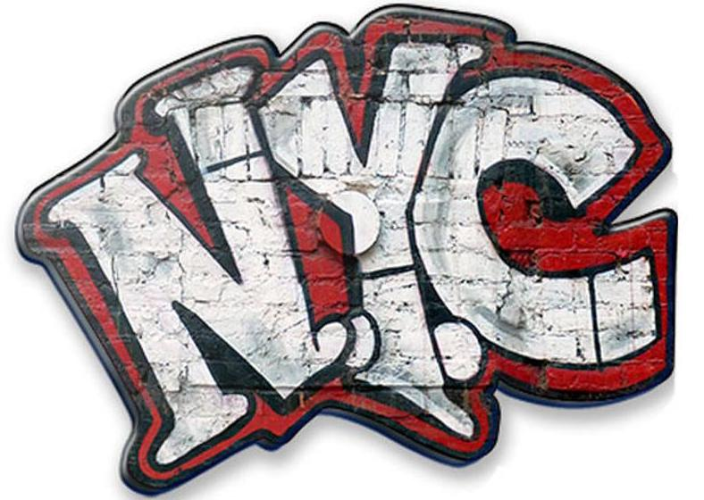

# Project 2: Shiny App Development Version 2.0

### [Project Description](doc/project2_desc.md)



In this second project of GR5243 Applied Data Science, we develop a version 2.0 of an *Exploratory Data Analysis and Visualization* shiny app on a topic of your choice using [NYC Open Data](https://opendata.cityofnewyork.us/) or U.S. government open data released on the [data.gov](https://data.gov/) website. See [Project 2 Description](doc/project2_desc.md) for more details.  

The **learning goals** for this project is:

- business intelligence for data science
- study legacy codes and further development
- data cleaning
- data visualization
- systems development/design life cycle
- shiny app/shiny server

*The above general statement about project 2 can be removed once you are finished with your project. It is optional.

## Tracking Graffiti in NYC

Link to our shiny app: [https://kkz777.shinyapps.io/project2_demo/](https://kkz777.shinyapps.io/project2_demo/)

Term: Fall 2019

+ Team # 7
+ **Tracking Graffiti in NYC**:
	+ Ting Cai
	+ Alexandra DeKinder
	+ Richard Lee
	+ Yicheng Li
	+ Kangkang Zhang

+ **Project summary**: Graffiti Free NYC is a program run by the Economic Development Corporation and the Department of Sanitation that offers free graffiti removal across New York City. The data used in this application represents the complaints filed through this program. The data includes information on date and location of the complaint, as well as the resolution status of the report.
The purpose of this app is to give city officials, and other interested parties, a way to visualize graffiti complaints in NYC. The app allows users to track the rate of graffiti complaints, the rate that they are resolved, and the different types of resolution action.

+ **Contribution statement**: ([default](doc/a_note_on_contributions.md)) All team members contributed equally in all stages of this project. All team members approve our work presented in this GitHub repository including this contributions statement. 

+ Yicheng Li proposed the topic of the analysis and acquired the primary dataset. He designed the workflow of the analysis. He also performed data cleaning, data analysis and eda to identify the factors to be analyzed.  
+ Ting Cai mainly worked on the Spot Map tab of the app where she built and made all functions work in the panel. She also performed data cleaning and data manipulation for the maps. She is also the presenter of this project.
+ Kangkang Zhang designed, built and made all functions work in the Heat Map tab panel where she cleaned the borough community district related data and calculated count and close rate, She also designed and finalized the general layouts of this shiny app and integrated the app.
+ Richard Lee created the plots and figures that can be seen in the Frequencies panel. He also created the function to switch between the different types of charts in UI.R and server.R; uploaded figures such as Borough Frequency, Resolution Frequency, Longitude vs Latitude, and Mapping charts for further analysis.
+ Alexandra DeKinder built the About tab and provided a detailed summary of the app in the tab to address the objective of this project and give instructions to the target users. She also investigated in supplementary datasets from different sources.

Following [suggestions](http://nicercode.github.io/blog/2013-04-05-projects/) by [RICH FITZJOHN](http://nicercode.github.io/about/#Team) (@richfitz). This folder is orgarnized as follows.

```
proj/
├── app/
├── lib/
├── data/
├── doc/
└── output/
```

Please see each subfolder for a README file.

